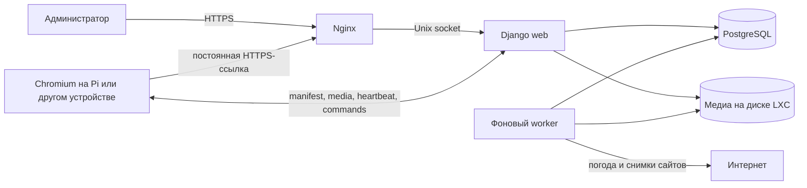

# Digital Signage ОГАУ ДО «СШ ВВЕ»: руководство и фактическая архитектура

Документ описывает не предполагаемую архитектуру, а состояние реализации,
проверенное 28 августа 2026 года. Базовая серверная версия на момент аудита —
`6d4721c`, версия браузерного плеера — `0.2.0-browser`.

## 1. Краткий итог

- Сервер работает в одном Debian 13 LXC на Proxmox без Docker.
- Клиентом сейчас является обычный Chromium-совместимый браузер. Отдельного
  Pi-Agent в поставке нет.
- Raspberry Pi получает постоянную секретную HTTPS-ссылку и не требует установки
  программ из этого репозитория.
- Текущая офлайн-модель не похожа на YouTube: браузер заранее скачивает целиком
  все локальные медиафайлы опубликованной ревизии, а не только очередной ролик.
- При первом запуске показ обычно ждёт загрузки всей ревизии. При обновлении старая
  ревизия продолжает работать, пока новая полностью загружается в фоне.
- Сервер умеет эффективно отдавать файлы и HTTP Range, но Service Worker текущей
  версии сначала сохраняет полный файл в Cache Storage.
- Транскодирование и адаптивное потоковое видео (HLS/DASH) не реализованы. Сервер
  хранит и отдаёт исходный загруженный файл.
- Собственный локальный CA не является обязательной частью продукта. Он создан
  установщиком только как начальный способ получить доверенный HTTPS. Его можно и
  рекомендуется заменить сертификатом существующего Microsoft CA.
- SHA-256 используется в нескольких независимых местах: для целостности медиа,
  хранения секрета ссылки экрана и проверки SSH-узла. Это разные проверки.

## 2. Из чего состоит система



Серверные компоненты:

- **Nginx** завершает HTTPS, принимает большие загрузки и отдаёт защищённые
  медиафайлы с диска;
- **Django** предоставляет панель управления, формирует публикации, проверяет
  секретную ссылку экрана и обслуживает браузерный плеер;
- **PostgreSQL** хранит настройки, библиотеку, плейлисты, ревизии, экраны,
  команды, задания и журнал действий;
- **signage-worker** проверяет изображения, запускает `ffprobe` для видео,
  получает погоду и делает снимки внешних сайтов;
- **файловое хранилище LXC** содержит оригиналы, снимки сайтов и резервные копии;
- **браузерный плеер** показывает очередь и хранит офлайн-копию публикации на
  диске клиентского устройства.

Между Nginx, Django и PostgreSQL нет отдельного TLS: все они находятся в одном
LXC и соединяются локально через Unix-сокеты. Локальный CA не используется для
внутренней аутентификации этих компонентов и не является центром выдачи
сертификатов экранам.

## 3. Основные понятия

| Понятие | Назначение |
| --- | --- |
| Контент | Сохранённое фото, видео или сайт. Один объект можно использовать многократно. |
| Сцена | Встроенный экран: часы, погода, заставка, фраза, объявление и т. п. |
| Плейлист | Упорядоченная очередь контента и сцен с расписанием и параметрами показа. |
| Канал | Плейлист плюс тема, звук, часовой пояс, погода и набор фраз. |
| Публикация/ревизия | Неизменяемый снимок канала, который получают экраны. |
| Экран | Конкретное клиентское устройство с постоянной секретной ссылкой. |
| Группа синхронизации | Общая временная шкала для нескольких экранов. |

Редактирование библиотеки или плейлиста само по себе не меняет работающие экраны.
Изменения начинают применяться только после команды **Опубликовать** у канала.

## 4. Полный путь файла от администратора до экрана

1. Администратор входит в панель `https://signage.vve.local/` и добавляет файл.
2. Браузер отправляет один файл обычной формой `multipart/form-data`.
3. Nginx передаёт запрос приложению без полного предварительного буферирования.
4. Django держит маленький файл в памяти, а файл больше 4 MiB записывает во
   временный файл на диске. После успешной загрузки оригинал оказывается в
   `/srv/signage/media/originals/<первые символы UUID>/<UUID>.<расширение>`.
5. В библиотеке появляется состояние **Обрабатывается**, а в PostgreSQL создаётся
   фоновое задание.
6. Worker последовательно читает весь файл, вычисляет SHA-256 и проверяет его:
   изображение открывается через Pillow, видео анализируется через `ffprobe`.
7. При успехе сохраняются размер, MIME, разрешение, длительность и технические
   метаданные; состояние меняется на **Готов**. При ошибке — на **Ошибка**.
8. Готовый объект добавляется в плейлист. Для видео длительность показа берётся из
   самого файла; введённое вручную время для видео не используется.
9. При публикации сервер создаёт новый неизменяемый manifest канала.
10. Экран замечает новую ревизию максимум примерно через 30 секунд, скачивает её
    локальные медиа и только после успешной подготовки переключается на неё.

### Ограничения загрузки на сервер

- Nginx разрешает тело запроса до **20 GiB**.
- Тайм-аут приёма тела — **1 час**.
- Это обычная, а не возобновляемая загрузка: при разрыве соединения файл придётся
  отправить заново.
- Интерфейс загружает по одному файлу за отправку; пакетная загрузка не сделана.
- Отдельного индикатора процента загрузки сейчас нет.
- SHA-256 требует один полный проход по файлу, а `ffprobe` имеет тайм-аут 120 секунд.
- Нужно оставлять свободное место как минимум ещё под размер крупнейшего файла;
  для эксплуатации разумен больший запас.

## 5. Как сейчас передаются и воспроизводятся файлы

### 5.1 Первая загрузка экрана

После открытия постоянной ссылки браузер регистрирует Service Worker. Он получает
manifest опубликованной ревизии и **последовательно загружает целиком каждый
`mediaUrl`**:

- фото;
- видео;
- PNG-снимки сайтов.

Для каждого файла выполняется проверка SHA-256, затем ответ сохраняется в Cache
Storage браузера. Только после успешного завершения всей ревизии она отмечается
активной. Живые сайты не входят в этот медиакеш.

Во время загрузки браузер передаёт ответ в Cache Storage потоковыми частями и не
обязан держать весь входящий файл в оперативной памяти. Однако для обслуживания
Range-запроса уже закешированного видео текущий Service Worker преобразует ответ в
`Blob`; это может создать большую задержку и расход памяти на крупных роликах.

### 5.2 Следующая публикация

Если на экране уже есть рабочая ревизия, происходит безопасное переключение:

1. старая ревизия продолжает проигрываться;
2. новая полностью скачивается в отдельный кеш;
3. при ошибке старая остаётся активной;
4. при успехе новая становится активной без промежуточной полупустой очереди;
5. хранятся текущая и предыдущая ревизии, более старые удаляются.

Логически одинаковые файлы сейчас заново запрашиваются при каждой новой ревизии,
поскольку кеши разделены по номеру публикации. На этапе переключения временно могут
одновременно существовать новая, текущая и предыдущая ревизии. Реальный расход
места определяет браузер; рассчитывать следует минимум на две полные ревизии и
дополнительный временный запас.

Даже если один и тот же объект несколько раз добавлен в один плейлист, цикл staging
выполнит несколько сетевых запросов к одному URL. Элементы с будущей датой или
неактивным сейчас дневным расписанием также скачиваются: расписание фильтруется при
показе, а не при подготовке кеша.

Предыдущий кеш хранится как резерв медиа для переходного периода. Готовой команды
**Откатить публикацию** и автоматического возврата к предыдущему manifest сейчас нет.

### 5.3 Похоже ли это на YouTube

Нет. В текущей версии отсутствуют:

- HLS или MPEG-DASH;
- разбиение видео на небольшие сегменты;
- несколько вариантов качества/битрейта;
- автоматическое переключение качества по скорости сети;
- загрузка только ближайшего ролика;
- продолжение оборванной загрузки.

Сам Nginx поддерживает эффективную отдачу с `sendfile` и HTTP Range. Если Service
Worker не управляет страницей, обычный `<video>` действительно может начать
воспроизведение после загрузки части файла и подкачивать следующие диапазоны. Но
штатный офлайн-режим текущей версии намеренно скачивает полную ревизию заранее,
поэтому рассчитывать на такой режим как на основную схему нельзя.

### 5.4 Что будет при потере сети

- Фото, видео, снимки сайтов, оболочка плеера и manifest активной ревизии продолжают
  работать из Cache Storage.
- После перезагрузки устройства офлайн-запуск возможен, если браузер не очистил
  данные сайта и кеш был успешно подготовлен.
- Живой сайт без сети не работает.
- Новая публикация, команды управления и обновление серверного времени без сети не
  приходят.
- Браузер вызывает `navigator.storage.persist()`, но решение принимает сам браузер.
  При нехватке квоты запись может завершиться ошибкой. Размер доступной квоты в
  интерфейсе пока не контролируется.

Не следует использовать приватный режим, автоматическую очистку профиля или общий
профиль для разных экранов.

## 6. Видео: что поддерживается фактически

Сервер **не перекодирует** видео. Наличие типа задания `TRANSCODE` в модели — только
незавершённая заготовка; worker это задание не выполняет. Каталоги `renditions` и
`thumbnails` тоже пока не являются рабочим конвейером вариантов качества.

`ffprobe` проверяет наличие видеопотока и извлекает разрешение и длительность, но не
гарантирует, что конкретный Chromium и конкретное устройство умеют декодировать
контейнер, кодек, профиль и звук.

Для первых испытаний рекомендуется:

| Параметр | Рекомендация |
| --- | --- |
| Контейнер | MP4 |
| Видео | H.264/AVC Main или High, `yuv420p` |
| Звук | AAC-LC |
| Подготовка файла | `faststart`, чтобы индекс MP4 находился в начале |
| Первая целевая нагрузка | Full HD, 25/30 кадр/с |

До отдельного теста на Raspberry Pi не следует считать гарантированными HEVC/H.265,
MKV, MOV, AV1, экзотические H.264-профили и 4K-видео. Raspberry Pi 5 имеет аппаратный
декодер HEVC 4Kp60, но остальные кодеки декодируются процессором, а доступность HEVC
в конкретной сборке Chromium — отдельный вопрос. Возможность вывести 4K на HDMI не
равна гарантии плавного декодирования любого 4K-файла в браузере.

### Что проверено на установленном сервере

28 августа 2026 года выполнен реальный smoke-test через штатную HTTPS-панель:

- MP4, H.264 High, `yuv420p`, 1280×720, 25 кадр/с;
- AAC-LC, 48 kHz, mono;
- длительность 3 секунды, размер 1 049 515 байт, `faststart`;
- вход и отправка формы завершились HTTP 302 штатного успешного сценария;
- worker выполнил задание с первой попытки;
- результат: `ready`, `video/mp4`, 1280×720, 3000 ms;
- SHA-256 исходного и сохранённого файла совпал:
  `2060400cf3105dc66b3c95afa451228e812ff7b20a445bedcf390681c5b908ba`;
- повторный `ffprobe` подтвердил те же H.264/AAC и длительность;
- рабочий канал остался на ревизии 1;
- тестовый объект, файл и задание после проверки удалены.

Это подтверждает загрузку, сохранение, worker, `ffprobe` и SHA-256. Пока не выполнены
физические испытания большого файла, 4K-декодирования и длительного воспроизведения
на Raspberry Pi. Эти проверки должны быть частью приёмочного теста.

## 7. Фото и сайты

### Фото

Pillow проверяет, что файл действительно открывается как изображение, и определяет
его формат и разрешение. В плейлисте доступны режимы:

- **Заполнить без искажения** (`cover`) — края могут обрезаться;
- **Показать целиком** (`contain`) — возможны поля;
- **Растянуть** (`stretch`) — весь экран, но пропорции могут исказиться.

### Живой сайт

Сайт открывается непосредственно на клиенте в изолированном `iframe`. Для него
нужна сеть. Сторонний сайт может запретить встраивание через CSP или
`X-Frame-Options`, потребовать вход, cookies или интерактивное подтверждение. Кроме
того, HTTPS-страница плеера не должна встраивать небезопасный HTTP-контент.

### Снимок сайта

Серверный Chromium без пользовательской сессии открывает внешний публичный URL и
создаёт PNG 1920×1080. Ожидание отрисовки — до 10 секунд, общий тайм-аут — 45 секунд.
Полученный PNG ведёт себя как обычная картинка и работает офлайн.

Локальные и приватные IP-адреса сейчас блокируются как защита от SSRF для **обоих**
режимов — и живого сайта, и серверного снимка. Поэтому добавить внутренний intranet
URL без изменения политики приложения нельзя. Снимок не содержит авторизованную
сессию пользователя. Автоматическое периодическое обновление уже созданного снимка
и кнопка ручного обновления в текущем простом интерфейсе не реализованы.

## 8. Публикации, расписание и цикл

Элемент плейлиста может иметь:

- период **Показывать с / до**;
- дни недели;
- ежедневное окно времени, включая переход через полночь;
- включение/выключение;
- длительность для фото, сайта и сцены;
- способ масштабирования;
- громкость и отключение звука.

Нижняя граница периода включительна, верхняя — исключительна: при наступлении
времени **до** элемент уже не показывается. Расписание вычисляется в браузере по
часовому поясу канала и времени, синхронизированному с сервером.

Когда сумма длительностей очереди закончилась, проигрывание начинается сначала.
Для видео в manifest всегда записывается фактическая длительность файла. Экраны в
группе синхронизации используют общую точку начала временной шкалы.

Изменение, отключение или удаление элемента не обрывает активную ревизию. Нужно
снова опубликовать канал, после чего клиенты безопасно подготовят следующую.

## 9. Фирменные сцены, фразы и погода

Реализованы сцены:

- официальная заставка;
- часы и дата;
- погода;
- часы и погода;
- меняющаяся фраза;
- объявление;
- фото с фирменной подложкой.

Фразы хранятся набором, включаются и выключаются, переименовываются, сортируются и
могут иметь собственный период показа. Изменения фраз применяются после публикации
канала.

Worker действительно получает Open-Meteo с заданным интервалом и сохраняет
последний успешный результат. Однако текущая опубликованная ревизия содержит копию
погоды на момент публикации; endpoint manifest пока не подставляет в неё свежие
данные автоматически. Поэтому обновление базы погоды раз в 15 минут ещё не означает
обновление уже работающего экрана без новой публикации. Это известное ограничение,
которое следует исправить до окончательной приёмки погодного виджета.

## 10. Зачем нужен HTTPS

HTTPS нужен не ради доступа в Интернет и не ради отдельного Pi-Agent. Он решает три
задачи:

1. защищает логин и пароль администратора;
2. защищает постоянный секрет в ссылке экрана и команды управления от перехвата и
   подмены в локальной сети;
3. создаёт **secure context**, без которого браузер не разрешает штатную регистрацию
   Service Worker и, следовательно, надёжный офлайн-кеш.

Текущая схема использует только обычный серверный TLS. Клиентские сертификаты и
mTLS не настроены: Raspberry Pi предъявляет секрет из URL, а не свой сертификат.

## 11. Собственный CA и Microsoft CA

Встроенный `VVE Signage Local CA` — только bootstrap-вариант установщика для тех,
у кого нет собственной PKI. Он подписал текущий сертификат Nginx и предоставляет
публичный корневой сертификат для ручной установки. Других функций он не выполняет.

**Полностью перейти на существующий Microsoft AD CS можно.** После переключения
отдельный Signage CA не нужен ни серверу, ни браузерам.

Предпочтительный выпуск — создать закрытый ключ и CSR непосредственно в LXC, а в
Microsoft CA передать только CSR. Тогда закрытый ключ сайта никогда не покидает
сервер. Экспорт PFX из Windows тоже возможен, но требует защищённой передачи и
преобразования ключа в PEM для Nginx.

### Что нужно выпустить в Microsoft CA

Сертификат типа **Web Server** со следующими свойствами:

- Subject или удобное отображаемое имя: `signage.vve.local`;
- обязательный SAN: `DNS:signage.vve.local`;
- при реальном открытии по IP — дополнительный SAN `IP:192.168.110.222`, но
  рекомендуется всегда использовать DNS-имя;
- Extended Key Usage: Server Authentication;
- допустимый современный ключ RSA или ECDSA;
- доступные клиентам CRL/AIA-адреса корпоративного CA, если политика их проверяет.

Для Nginx нужны:

| Файл на сервере | Содержимое | Секретный |
| --- | --- | --- |
| `/etc/signage/tls/server.crt` | Сертификат `signage.vve.local` и промежуточные сертификаты в PEM | Нет |
| `/etc/signage/tls/server.key` | Соответствующий закрытый ключ конечного сертификата, PEM без интерактивного пароля | **Да** |
| `/etc/signage/tls/ca.crt` | Только публичная цепочка/корневой сертификат CA для проверки и, при желании, скачивания | Нет |

Нельзя передавать или размещать в LXC закрытый ключ корневого либо промежуточного
Microsoft CA. Нужен только закрытый ключ конкретного сертификата сайта.

Перед включением проверяются:

- читаемость PEM;
- совпадение публичного ключа сертификата и `server.key`;
- SAN и срок действия;
- полная цепочка;
- конфигурация Nginx;
- HTTPS health-check и открытие с клиента.

После успешной проверки Nginx перечитывает сертификат без изменения приложения,
БД, ссылок экранов или кеша. Старый локальный CA можно убрать из доверенных хранилищ
после того, как все клиенты перешли на новый сертификат. Endpoint
`/signage-ca.crt` не является обязательным для runtime: его можно направить на
публичный корневой сертификат организации. Однако текущий `install.sh` проверяет
наличие `/etc/signage/tls/ca.crt` и использует его в health-check. До исправления
установщика этот файл удалять нельзя, иначе повторная установка может создать новый
локальный CA. Старый `/etc/signage/tls/ca.key` после подтверждённого перехода не
нужен и хранить онлайн-ключ отдельного Signage CA на сервере нежелательно.

### Доверие на Raspberry Pi

Если корпоративный корневой сертификат уже централизованно доверен устройству и
профилю Chromium, больше ничего не требуется. Для автономной настройки Linux нужно
установить **только публичный** корневой сертификат в системное хранилище и убедиться,
что его видит профиль Chromium. На новых версиях Chromium для Linux используется
NSS Shared DB; актуальный путь профиля следует проверять для установленной версии.

Доверие к собственному Microsoft CA полностью совместимо с изолированной локальной
сетью. Публичный центр сертификации и доступ клиента в Интернет не требуются.
Интернет нужен серверу только для выбранного API погоды и внешних сайтов.

## 12. Что именно означает SHA-256

В системе встречаются три независимых применения SHA-256.

### 12.1 SHA-256 медиафайла

Worker вычисляет хеш уже сохранённого оригинала и записывает его в manifest. Во
время подготовки ревизии Service Worker передаёт ожидаемое значение механизму
Subresource Integrity. Если скачанные байты не дают тот же хеш, fetch завершается
ошибкой и новая ревизия не активируется.

Это защищает от повреждения файла, неожиданной подмены содержимого, ошибки кеша или
несогласованности между manifest и хранилищем. HTTPS уже защищает канал и личность
сервера; SHA-256 дополнительно связывает публикацию с точными байтами конкретного
файла. Это не проверка узла перед соединением и не цифровая подпись: полностью
скомпрометированный сервер способен заменить и файл, и ожидаемый хеш.

### 12.2 SHA-256 секрета экрана

Полный токен постоянной ссылки показывается при создании экрана один раз. В БД
хранится его SHA-256, а при запросе сервер хеширует присланный токен и сравнивает
значения константным по времени способом. Поэтому из обычной записи БД нельзя сразу
получить готовую секретную ссылку.

### 12.3 SHA-256 fingerprint SSH-ключа узла

Перед административным SSH-подключением проверяется короткий отпечаток публичного
host key контейнера и затем ключ закрепляется в `known_hosts`. Это защищает от
подключения не к тому серверу и от атаки посредника на SSH. Проверка относится к
SSH-развёртыванию и не связана ни с сертификатом сайта, ни с хешем видео.

TLS-сертификат браузер проверяет отдельно: строит цепочку до доверенного Microsoft
CA, проверяет подпись, SAN, срок действия и применимые политики.

## 13. Состояние Pi-Agent

Отдельный Pi-Agent **не реализован и сейчас не используется**:

- нет исполняемого агента или Python-пакета;
- нет клиентского установщика и systemd-unit для Pi;
- нет механизма обновления агента;
- нет watchdog, скриншотов экрана, перезагрузки ОС или управления Chromium как
  процессом;
- нет отдельного протокола регистрации/pairing агента.

Пустые локальные каталоги `client/pi_agent`, `client/tests` и `deploy/pi` не входят
в Git и не содержат реализации. В раннем описании агент был намерением, затем
плеер был переведён в browser-only архитектуру.

Серверные endpoint-ы manifest, media, heartbeat, commands и acknowledgement не
являются мёртвым наследием агента: ими прямо сейчас пользуется браузер. Они достаточно
нейтральны, чтобы в будущем тот же протокол мог использовать и агент.

Незавершённые заготовки, не относящиеся к рабочему агенту:

- `WorkerJob.TRANSCODE` без обработчика;
- каталоги `renditions` и `thumbnails` без рабочего конвейера;
- старое упоминание SSE, хотя команды доставляются обычным heartbeat polling;
- старое обещание watchdog renderer, которого нет.

## 14. Браузер или будущий Pi-Agent

| Возможность | Браузер сейчас | Возможный Pi-Agent |
| --- | --- | --- |
| Установка проекта на клиент | Не нужна | Нужна установка и обновление |
| Любое устройство с браузером | Да | Потребуется отдельная сборка под ОС |
| Фото, видео, сцены, сайты | Да | Всё равно нужен браузер или несколько движков |
| Автозапуск и kiosk | Настраивается средствами ОС | Агент может настраивать/контролировать |
| Офлайн-кеш | Есть, но ограничен квотой браузера | Можно хранить обычные файлы без browser quota |
| Контроль процесса | Только команда reload страницы | Можно перезапускать зависший Chromium |
| Телеметрия | Heartbeat, ревизия, user-agent, ошибка | Можно добавить CPU, RAM, диск, температуру |
| Управление ОС | Нет | Можно добавить reboot, shutdown, обновление |
| Скриншот фактического экрана | Нет | Можно добавить |
| Цена по ресурсам | В основном Chromium | Малый daemon плюс всё тот же renderer |
| Headless ОС | Не выводит картинку без графического стека | Агент-демон может быть headless, но для HDMI всё равно нужен renderer |

Для текущих задач browser-only вариант закрывает основную функцию и сохраняет
независимость от Raspberry Pi. Лёгкий агент имел бы смысл прежде всего как
**необязательный supervisor**: запускать и перезапускать Chromium, собирать
телеметрию, управлять ОС и хранить большие файлы вне Cache Storage. Он не должен
заменять существующую ссылку или ломать обычный браузерный режим.

Пока реальные испытания не покажут зависания или нехватку контроля, добавление
агента увеличит объём сопровождения сильнее, чем улучшит собственно показ. Главная
текущая проблема больших видео — политика кеширования и отсутствие профилей
транскодирования; один лишь лёгкий daemon её автоматически не решит.

## 15. Требования к клиентскому устройству

### Рекомендуемый вариант для Raspberry Pi 5

- Raspberry Pi OS 64-bit с графической средой или Debian 64-bit с минимальным
  Wayland/X-сеансом;
- Chromium актуальной версии;
- 4 GiB RAM как практический минимум проекта, 8 GiB — с запасом для 4K, тяжёлых
  сайтов и крупных кешей;
- достаточный SSD/microSD для ОС и как минимум двух полных опубликованных ревизий;
- корректный DNS для `signage.vve.local`;
- синхронизация времени;
- доверие к корпоративному Microsoft CA в профиле Chromium;
- отдельный пользователь и отдельный постоянный профиль браузера для каждого
  физического экрана.

Официальный kiosk-сценарий Raspberry Pi требует графический браузер и допускает
устройства от 1 GiB RAM, но это не означает, что 1 GiB достаточно для данного
плейлиста и больших видео. Точные CPU/RAM следует измерить на ваших файлах.

Полная desktop-среда не обязательна: можно поставить минимальный Wayland/X и
Chromium. Чистая console-only/headless система без графического стека не сможет
вывести браузерный плеер на HDMI. Будущий агент тоже потребует графический renderer,
если устройство должно показывать изображение.

## 16. Подключение нового экрана

1. Подготовить DNS и проверить открытие `signage.vve.local` с устройства.
2. Установить доверие к действующему корпоративному корневому CA.
3. Создать отдельного kiosk-пользователя и постоянный профиль Chromium.
4. В панели сервера открыть **Экраны**, нажать **Добавить экран**, выбрать канал и
   скопировать выданную секретную ссылку. Полный токен второй раз не показывается.
5. Один раз открыть ссылку обычным окном и убедиться, что нет ошибки сертификата.
6. Настроить автозапуск Chromium в kiosk-режиме, например:

```bash
chromium --kiosk --no-first-run --noerrdialogs \
  --disable-session-crashed-bubble \
  --autoplay-policy=no-user-gesture-required \
  'https://signage.vve.local/display/SCREEN_ID/SCREEN_TOKEN/'
```

7. Перезагрузить Pi и проверить автоматический запуск, полноэкранный режим, звук,
   статус экрана и последнюю связь в панели.

Официальный Raspberry Pi OS с labwc запускает kiosk-команду из
`~/.config/labwc/autostart`. Конкретная инструкция зависит от выбранного образа ОС
и будет зафиксирована после приведения Pi к единой конфигурации.

Ссылка является секретом уровня bearer token. Её не следует публиковать, отправлять
в общедоступный чат или использовать на нескольких физических экранах. Если ссылка
утекла, текущий простой интерфейс не выпускает новый токен; безопасный вариант —
отключить старый экран и создать новый.

## 17. Работа в панели управления

### Контент

1. Открыть **Контент** → **Добавить контент**.
2. Ввести понятное внутреннее название.
3. Выбрать **Фото**, **Видео** или **Сайт**.
4. Для сайта выбрать **Живой сайт** либо **Снимок сайта**.
5. Дождаться состояния **Готов**.

Контент можно искать, сортировать, переименовывать, включать и выключать. Удаление
разрешено только после удаления ссылок из плейлистов и сейчас является мягким:
запись скрывается, но автоматическое физическое освобождение исходного файла ещё не
реализовано.

### Сцены и фразы

В **Сценах** редактируются подпись шапки, метка, заголовок и текст. В **Фразах**
можно добавлять, включать, отключать, менять порядок, длительность и даты действия.

### Плейлист

1. Создать плейлист или открыть стартовый.
2. Добавить контент либо сцену.
3. Задать длительность для фото/сайта/сцены, расписание, масштабирование и звук.
4. Перетащить карточки в нужный порядок.
5. При необходимости временно отключить элемент без удаления из библиотеки.

### Канал и публикация

Канал связывает плейлист с темой, погодой, фразами и общим звуком. После любых
нужных изменений нажать **Опубликовать**. Публикация не должна выполняться, пока
нужный файл находится в состоянии **Обрабатывается** или **Ошибка**.

### Экраны и команды

Браузер отправляет heartbeat каждые 15 секунд. Manifest проверяется раз в 30 секунд.
Команды **предыдущий**, **следующий**, **перезагрузить**, **выключить/включить звук**
и **громкость** приходят с ближайшим heartbeat и подтверждаются браузером. Команда
живёт 5 минут.

Панель считает экран подключённым, если heartbeat был не более 90 секунд назад.
Поле сохранённого статуса `online` сейчас автоматически не переводится в `offline`
после пропадания клиента, поэтому при диагностике важнее смотреть время последней
связи.

## 18. Минимальный приёмочный тест

Перед массовым развёртыванием выполнить на одном Pi 5:

1. загрузка фото Full HD и 4K;
2. загрузка рекомендованного MP4 Full HD;
3. отдельный тест каждого реального 4K-ролика;
4. первый запуск с пустым кешем и измерение времени/места;
5. публикация новой ревизии во время показа старой;
6. отключение сети во время фото и видео;
7. перезагрузка Pi при отключённом сервере;
8. восстановление сети и получение новой публикации;
9. звук, mute, volume, следующий/предыдущий;
10. расписание, включая границы дат и переход через полночь;
11. живой сайт и его ограничения iframe;
12. снимок внешнего сайта;
13. работа 24–72 часа без вмешательства;
14. заполнение кеша объёмом, близким к реальному;
15. холодная перезагрузка и автозапуск kiosk.

## 19. Известные ограничения, важные до эксплуатации

1. Полная предварительная загрузка всех медиа новой ревизии плохо масштабируется на
   много больших 4K-видео.
2. Нет HLS/DASH, транскодирования, профилей Full HD/4K и проверки совместимости
   кодека с клиентом.
3. Нет возобновляемой и пакетной загрузки файлов.
4. Квота Cache Storage заранее не оценивается, результат `persist()` не показывается.
5. Range из кеша реализован через полный `Blob`, что рискованно для крупных файлов.
6. Неизменившиеся файлы повторно загружаются для новой ревизии.
7. Погода в опубликованной ревизии не обновляется на экране до новой публикации.
8. Снимки сайтов не обновляются по расписанию.
9. Физическая очистка мягко удалённых медиа не реализована.
10. Pi-Agent/watchdog и удалённое управление ОС отсутствуют.
11. Нет автоматической смены утёкшего токена экрана.
12. 4K и длительная работа на реальном Pi пока не прошли приёмочный тест.
13. Номер ревизии уникален только внутри канала, а клиент сравнивает только номер.
    Если экран переназначить с канала A ревизии 3 на канал B ревизии 3, Service
    Worker может ошибочно не выполнить полный staging нового канала.
14. Снимок сайта хранится по имени asset и перезаписывается. До новой публикации это
    может нарушить неизменяемость старой ревизии и её ожидаемый SHA-256.
15. Переключение серверного указателя публикации атомарно, но каждый физический
    экран скачивает и активирует её независимо; одновременной транзакции на весь
    парк устройств нет.
16. Внешний `imageUrl` сцены «Фото с подложкой» не входит в staging Service Worker,
    поэтому офлайн-показ такого внешнего изображения не гарантирован.
17. Секретный token экрана является частью URL и сейчас может попадать в историю
    браузера, аргументы запуска kiosk и обычный access log Nginx. Ротации token и
    маскирования player URL в журнале пока нет.
18. Bootstrap-установщик хранит закрытый ключ своего локального CA на том же LXC и
    проверяет TLS-файлы только по наличию. Для корпоративной эксплуатации нужен
    явный режим внешней PKI с проверкой пары ключ/сертификат и срока действия.

Для больших медиабиблиотек рекомендуемое следующее изменение — управляемый гибридный
режим: фото и небольшие ролики кешировать, крупные видео отдавать по HTTP Range по
мере просмотра, заранее готовить ближайший элемент, повторно использовать неизменные
файлы между ревизиями и показывать оператору оценку требуемого места. Полный офлайн
режим можно оставить как отдельную настройку канала/экрана.

## 20. Сервер и резервирование

Текущий LXC имеет 4 GiB RAM и диск около 49 GiB, из которых на момент проверки было
свободно около 44 GiB. Этого достаточно для разработки и небольшого теста, но не
для большой 4K-библиотеки. Для рабочей эксплуатации разумно предусмотреть не менее
250 GiB медиадиска и 8 GiB RAM, а затем скорректировать по реальному объёму.

Ежедневный `pg_dump` хранится 14 дней, но он содержит только PostgreSQL. Нужен также
регулярный backup всего LXC или как минимум `/srv/signage`, иначе файлы библиотеки в
дамп БД не попадут.

## 21. Рекомендуемое решение на текущем этапе

1. Оставить браузерный режим основным и обязательным.
2. Перевести HTTPS на существующий Microsoft CA.
3. Провести приёмочный тест Full HD и реальных 4K-файлов на одном Pi 5.
4. До массовой загрузки больших видео заменить полное кеширование на гибридный
   настраиваемый режим и устранить `Blob` для больших Range-запросов.
5. Добавить серверное транскодирование/профили либо строгую проверку разрешённых
   форматов.
6. Исправить динамическое обновление погоды и обслуживание удалённых файлов.
7. Возвращаться к Pi-Agent только при подтверждённой потребности в watchdog,
   телеметрии и управлении ОС; реализовывать его как необязательное дополнение.

## 22. Официальные справочные материалы

- [Raspberry Pi: настройка kiosk-режима](https://www.raspberrypi.com/tutorials/how-to-use-a-raspberry-pi-in-kiosk-mode/)
- [Raspberry Pi: характеристики процессора и видеодекодирования Pi 5](https://www.raspberrypi.com/documentation/hardware/raspberrypi/bcm2835/)
- [Chromium: управление сертификатами в Linux](https://chromium.googlesource.com/chromium/src/+/master/docs/linux/cert_management.md)
- [MDN: Service Worker требует secure context](https://developer.mozilla.org/en-US/docs/Web/API/ServiceWorkerContainer/register)
- [MDN: квоты и удаление данных browser storage](https://developer.mozilla.org/en-US/docs/Web/API/Storage_API/Storage_quotas_and_eviction_criteria)
